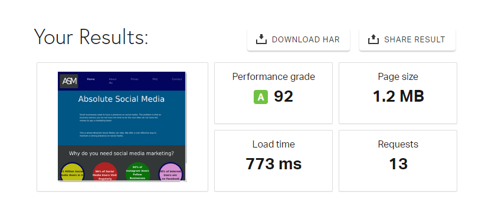
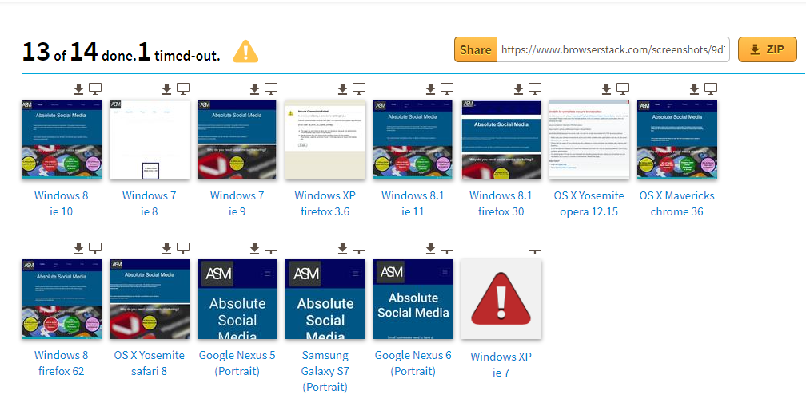

# Absolute Social Media 
Absolute Social Media is a company that helps small businesses to have a presence on Social Media sites. We get paid monthly to put posts on the company's accounts.

## Description

This website is for the business 'Absolute Social Media.' It exists to promote the business, as a way for small businesses to view what can be offered to them and a medium to contact the company.

[Here](assets/wireframes) are the wireframes that I was working from:

Here is a link to the live site:

https://mphil17.github.io/Milestone-Project-1-Social-Media/

# User Experience

## Visual identity

The colour scheme is mainly different shades of blue. This moves away from the initial wireframe because I felt that blue is a calming colour which gives the idea of professionalism. Those looking for Social Media marketing solutions would want a company who works with calm, organised professionalism. Other colours have been used to make them stand out against the background.

The picture in the background in the second section breaks up the colours well and adds to the look of the website.

The page is responsive so that users of small and larger screens can use it effectively. 

The logo remains in the top left with the navigation bar remaining at the top and the footer at the bottom.

## User Stories

Users of the website will be small businesses looking for marketing solutions.
They will want:
- To be reassured that the company is professional
- To understand a little more why social media marketing is necessary
- To know the pricing structure
- To be able to contact ASM

To achieve these goals, I have:
- Created an 'About Me' page
- Added statistics about social media use
- Added a prices page with clear pricing structure
- Added a contact page to contact through email

## Features

The site does not need too many features as it is informational in the main. It does have:

- A contact page so that businesses can contact the company

## Testing

The site was tested on the W3C Validator and any bugs resolved.

The site's speed was tested using Pingdom. Results:

The site's versatility on different browsers was checked using Browser Stack. The website works less well on older browsers. Results:

## Scalability

Features that were identified as being outside the scope at this stage but could be addressed in the future:
- Businesses may want to pay online and so could click on prices and be funnelled into Paypal etc.
- Contact page does not currently go anywhere and can do in the future.
- The site could have more animation to make it stand out mroe from the competition.

## Technologies

The technologies (wesbites and libraries) used on this project were:
- Bootstrap
- JQuery
- Google Fonts
- Font-Awesome
- Hover.css
- Pixels.com

## Acknowledgements

Thank you to Chris Towland for the idea for the website and the wording for the privacy policy.

Thank you to [Felipe Souza Alarcon](https://github.com/felipe-alarcon) for your invaluable help as a mentor.